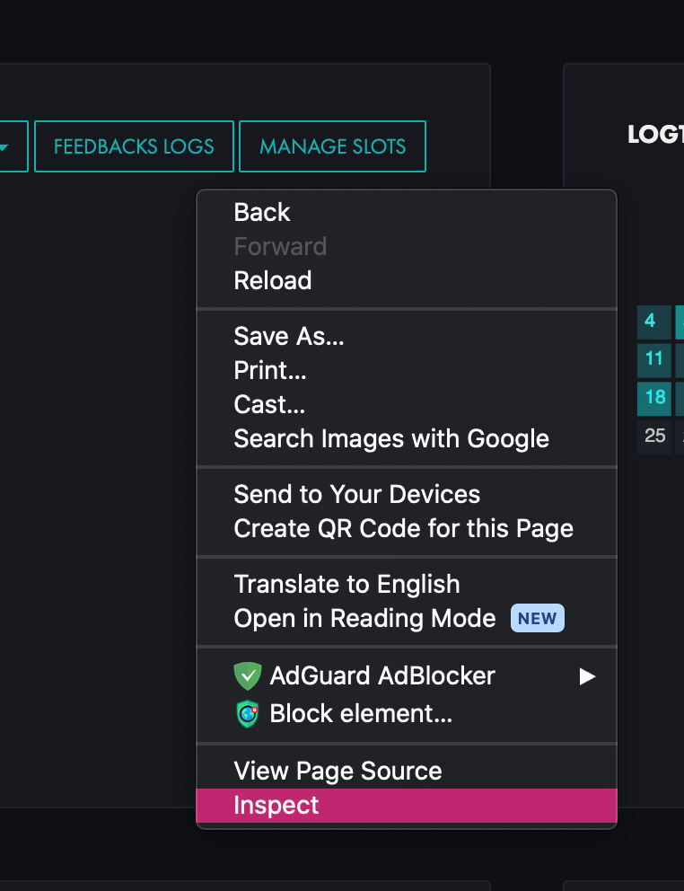
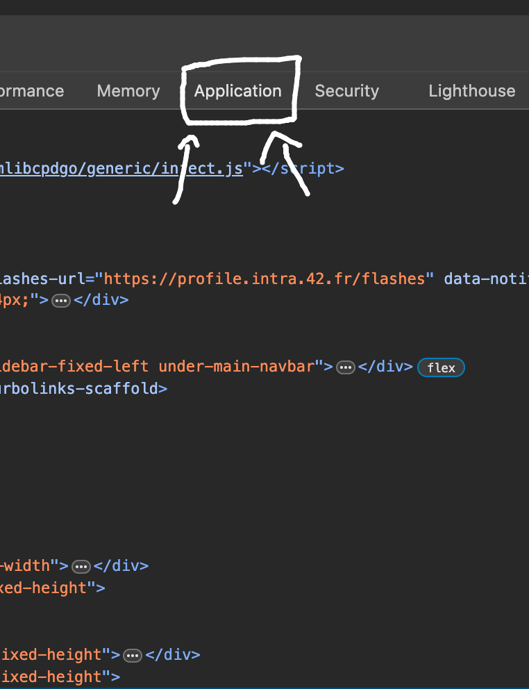
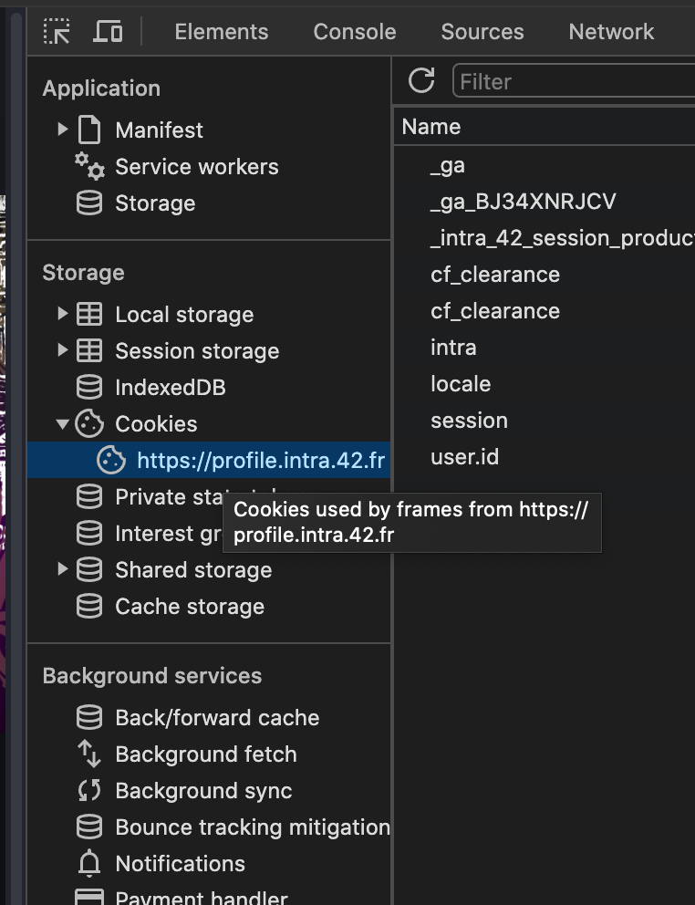
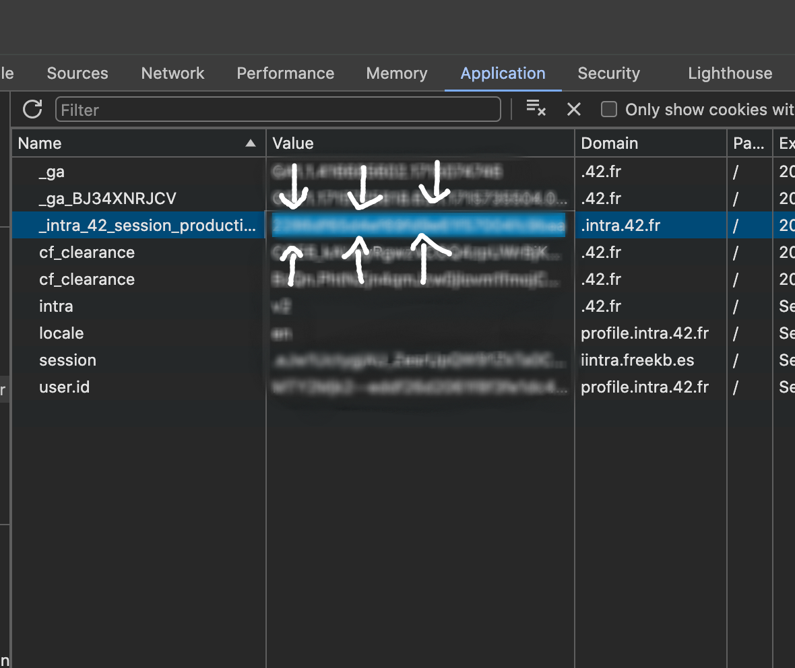

# Auto Slots

This repository contains a Python script and a bash script to automate the process of booking slots on the 42 Intra platform or delete them.

## Files

- `auto_slots.py`: A Python script that uses the requests library to interact with the 42 Intra platform's API to book slots.
- `delete_slots.py`: A Python script that uses the requests library to interact with the 42 Intra platform's API to delete slots.
- `run.sh`: A bash script that sets up a virtual environment, installs the necessary dependencies, and runs the Python script.

## how to get your _intra_42_session_production

go to the your intra home page, right click and click inspect element



then search for application in the heading bar and click it



after that in storage -> cookies click on "https://profile.intra.42.fr/"



finaly you'll find your `_intra_42_session_production` copy it and run the script with it



## Usage

The bash script automates the process of setting up a virtual environment, installing the necessary dependencies, and running the Python script.

To use the bash script, you need to provide your 42 Intra session cookie as a command-line argument.

```bash
./run.sh <take or delete> <your _intra_42_session_production>
```

The script will then set up a virtual environment, install the requests library, and run the Python script with the provided session cookie.

When the script is stopped (either due to an error or manually), it will clean up by removing the virtual environment.

## Disclaimer

This script is intended for educational purposes only. Use it at your own risk. The author is not responsible for any misuse of this script.
